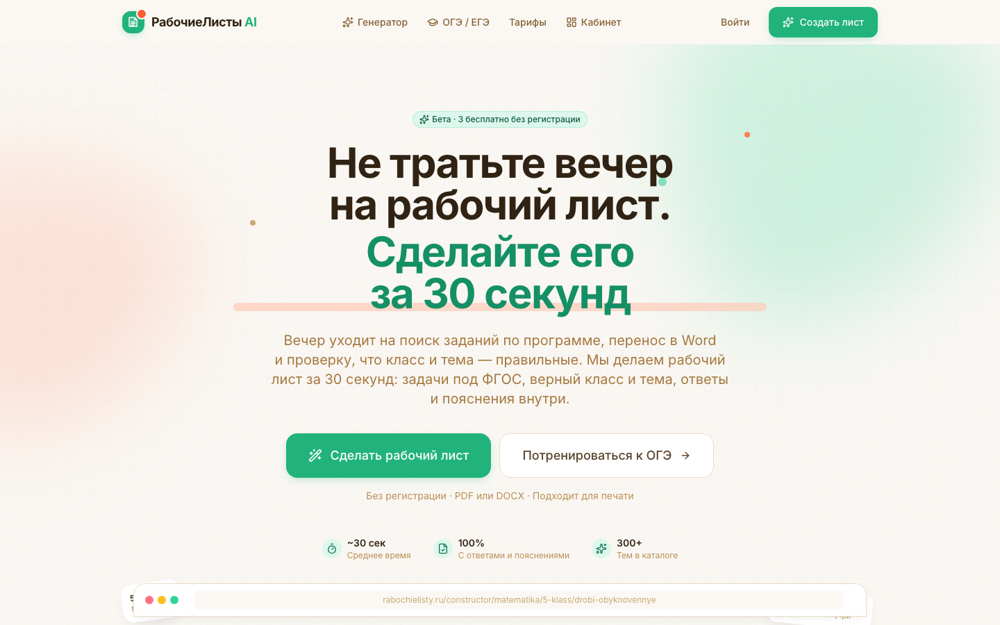
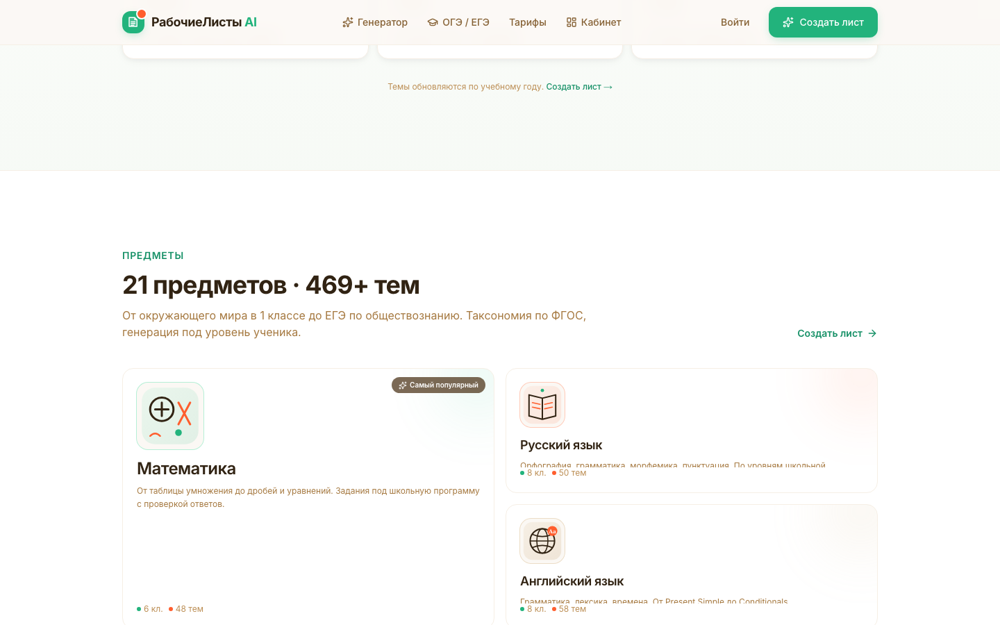
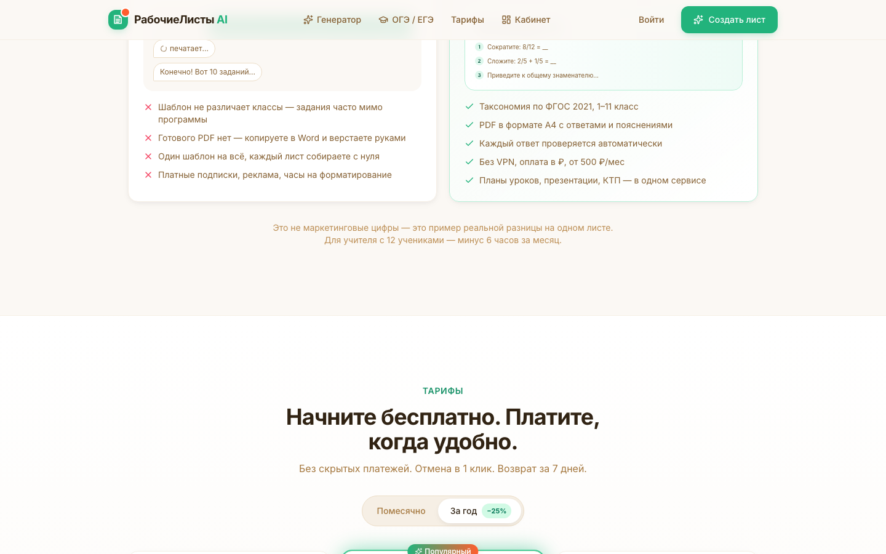
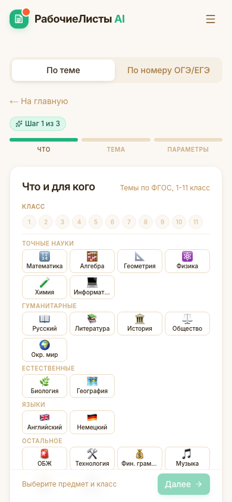

# Ревю дизайна, маркетинга и позиционирования — РабочиеЛисты AI

> **Дата:** 2 октября 2026
> **Кто делал:** Mavis по запросу владельца продукта
> **Что смотрели:** код репозитория `nameone` (фронт Next.js + бэк Hono) + живой прод + тексты конкурентов
> **Связи:** не дублирует `docs/POSITIONING.md` (заявленное позиционирование), `docs/04-pricing-economics*.md` (экономика), `work/2026-09-29-market-overview/market-overview.md` (рынок на 29.09). Здесь — разрыв между замыслом и тем, что реально видит учитель.

---

## 0. Как читать отчёт

Ответ на один вопрос: **где продукт теряет деньги и почему**. Порядок разделов — по убыванию убытка.

Каждая находка дана в связке: что не так → где это (`файл:строка`) → чем вредит → что сделать. Без «файла:строка» в отчёте нет ни одной находки, кроме рыночных данных.

Скриншоты прода лежат в `docs/review-2026-10-02/img/` — они сняты с боевого сайта 2 октября, не из макета.

---

## 1. Главное за 60 секунд

| Зона | Состояние | Комментарий |
|---|---|---|
| **Монетизация** | 🔴 **денег нет** | Кнопка «Оформить» не делает ничего. Конверсия в оплату строго 0 |
| **Домен и SEO** | 🔴 **не работает** | `rabochielisty.ru` не резолвится. Все 1 854 URL в карте сайта указывают в пустоту |
| **Аналитика** | 🔴 **нет данных** | На проде ноль счётчиков, трекер событий — заглушка. Проверить результат нечем |
| **Обещания** | 🔴 **не выполнены** | «7 дней бесплатно», «Telegram-бот в Плюсе», «возврат за 7 дней» — при неработающей оплате |
| **Продукт в проде** | 🔴 **отдаёт моки** | При сбое backend учитель молча получает шаблон вместо AI-задания |
| **Права и доверие** | 🔴 **нет реквизитов** | В оферте нет ИП/ООО, ИНН, адреса. Почта на мёртвом домене |
| **Дизайн** | 🟡 **система есть, исполнение сбоит** | Палитра и UI-кит хорошие, но 35 кнопок и селектов на 19 страницах без высоты |
| **Тексты и SEO-мелочи** | 🟡 **видимые ошибки** | «21 предметов», «по математика», «РабочиеЛисты AI · РабочиеЛисты AI» в заголовках |
| **Позиционирование** | 🟡 **заявлено ≠ продаётся** | Главные козыри (УМК, 152-ФЗ) не видны на сайте |
| **Конкуренты** | 🟢 **окно есть** | Ниша не занята, но и наш главный аргумент (SEO) сломан |

---

## 2. Три блокера, которые съедают деньги

Пока не починены эти три — всё остальное в отчёте косметика.

### 2.1 Кнопка оплаты не делает ничего

`src/components/shared/PaywallModal.tsx:43-45`

```tsx
const handlePlanClick = (planId: string) => () => {
  trackEvent("paywall_plan_click", { planId });
};
```

Учитель доходит до paywall — это самый горячий момент воронки, самый продуманный экран в продукте: два тарифа, ценники, бейдж «Популярный», СБП, возврат. Нажимает «Оформить Базовый» → ничего. Бэкенд с ЮKassa, webhook и апгрейдом плана написан (`backend/src/routes/billing.ts:66,105,138`) и просто не вызывается.

**Что делать:** `onClick` → `POST /api/billing/create` → редирект на `confirmation_url`. Пока webhook не готов — кнопка ведёт на `/pricing` (страница существует). Одно условие: **до починки снять с `/pricing` «7 дней бесплатно»** (см. 4.3), иначе получим teacher churn и претензии по возвратам.

### 2.2 Домен `rabochielisty.ru` не существует

Проверено 2 октября 2026:

```
dig +short rabochielisty.ru A     → пусто
dig +short rabochielisty.ru NS    → пусто
curl https://rabochielisty.ru/     → Could not resolve host
```

Сайт живёт на `https://listai-prototype.pages.dev/` (200 OK). Доменное имя зафиксировано в бренд-доке как ядро всей SEO-стратегии: «Exact-match SEO, домен = запрос» (`docs/BRAND.md:19`), 240+ страниц ловят длинный хвост.

Что из-за этого происходит прямо сейчас:

- **1 854 URL в `sitemap.xml`** отдают `https://rabochielisty.ru/...` — Google получит карту сайта, состоящую из несуществующего хоста.
- **`robots.txt`** указывает `Sitemap: https://rabochielisty.ru/sitemap.xml` — тоже в пустоту.
- **`canonical` и OG-картинки** на всех SEO-страницах — `rabochielisty.ru`. При переезде страниц на новый домен Google увидит 1 854 редиректа.
- **Картинка в Telegram/VK** (`og:image = rabochielisty.ru/og/default.png`) не загрузится — то есть при отправке ссылки в чат, а это основной канал учителей, превью не будет. Всё, что вложено в OG-генератор, сейчас не работает.
- **Почта поддержки** `hello@rabochielisty.ru` — недоступна. В футере из четырёх контактов живой один (Telegram, 200 OK).

**Что делать:** купить домен (≈600 ₽/год) и настроить CNAME **этот же день**. Пока не куплен — деплоить на `rabochielisty.ru` нельзя, иначе первая же выдача закрепится за мёртвым хостом. Обходной путь на время ожидания: `NEXT_PUBLIC_SITE_URL` уже прокинут в `sitemap.ts` и `robots.ts` — достаточно выставить его на рабочий хост и пересобрать, тогда canonical и карта сайта станут валидными.

### 2.3 Аналитики нет вообще

- На боевом сайте ноль счётчиков: grep по `ym(`, `gtag`, `plausible`, `metrika` — пусто.
- `src/lib/track.ts:7-12` — **заглушка**: `trackEvent` пишет в `console.debug` только при `NODE_ENV !== "production"`, то есть в проде молча ничего не делает. При этом события вызываются из 9 файлов, включая paywall и шаги конструктора.
- `src/app/layout.tsx:82` — `<YandexMetrika />` закомментирован («next/script ломает static export»). Сам компонент написан, у него даже cookieless-режим под 152-ФЗ.

Следствие: `docs/POSITIONING.md §8` («метрики на 30/90 дней») выполнить нечем. Любая гипотеза в этом отчёте — от скидки до цены — сейчас непроверяема.

**Что делать:** инлайн-скрипт счётчика прямо в `layout.tsx` (без `next/script` — именно он ломал сборку) либо Plausible/Topvisor, как уже предлагает `src/components/analytics/YandexMetrika.tsx:12-13`. Плюс переписать `track.ts` на отправку в endpoint и убрать проверку `NODE_ENV`. Полдня работы — и появляется воронка, которую видно.

---

## 3. Что хорошо — и это правда хорошо

Проект не в плохом состоянии. Каталог, честность текстов и качество бэкенда — сильные стороны, на них стоит опираться.

**Маркетинг и продукт**

- **Цены в одном месте.** `src/lib/content/plans.ts:2-6` — комментарий прямо фиксирует историю: «цены были зашиты в шести местах, разошлись между собой». Сейчас все шесть читают оттуда, и на это есть тест `tests/integration/plans-price-sources.test.ts`. Редкая, правильная работа.
- **Честная экономика «учебного года».** `plans.ts:147` — комментарий `9 × 500 = 4500, платим 3800 → −15,5% (обе цифры в UI)`. Скидка показана двумя числами, а не одной цифрой в углу. Так делают единицы.
- **Цифры на сайте настоящие.** `src/components/landing/Stats.tsx:7-10` — «Реальные метрики продукта (не выдуманные цифры активности)», значения считаются из таксономии в рантайме. Плюс `Stats.tsx:46-47` решает русскую грамматику через `labelForms`, а не строкой.
- **FAQ отвечает на реальные возражения, а не на выдуманные.** `FAQ.tsx:16` честно признаёт границу: «Для 10–11 классов ждём ФГОС СОО, который вступает с 01.09.2027». `FAQ.tsx:44` отвечает на скрытое возражение и переворачивает его: «PDF с реальным текстом, поэтому задания можно копировать. Редактировать в Word нельзя — но в этом и смысл».
- **Проба без регистрации.** Учитель получает ценность, не отдавая email. На старте, без отзывов и рекламы, это правильное решение.
- **Согласие на ПДн ребёнка встроено в продукт.** `src/components/teacher/PhotoUpload.tsx:88-92` и отдельный чекбокс `:109-110`. Механизм есть — не хватает только текста на сайте (см. 4.5).

**Дизайн**

- **Палитра осмысленная, не дефолтная.** `tailwind.config.ts:11-52`: мятный бренд / персик-акцент / тёплый нейтраль, 11 шагов каждый. Тени с именами (`soft`, `soft-lg`, `brand`, `accent`) вместо `shadow-lg` вразброс.
- **Дисциплина токенов.** Из 402 вхождений hex во всём `src` 390 уходят в SVG-иллюстрации и шаблоны печати — там хардкод уместен. В логике осталось 6. Это редко.
- **UI-кит написан грамотно.** `Button` — 5 вариантов × 4 размера, `loading`, рендерится и как `<button>`, и как `<Link>`. `Input` — `useId()` + `<label htmlFor>`. `Select` закрывается по Escape и клику вне. `Modal` на мобильном превращается в bottom-sheet.
- **Hero сделан умело.** `&nbsp;`-переносы против мобильных переносов (`Hero.tsx:37,46`), `text-balance`, мокап с реальными заданиями, 3D-tilt под `motion-safe:`.

  

- **Экран генерации — образец.** `constructor/page.tsx:2472-2479`: `role="progressbar"` с `aria-valuenow/min/max`, `aria-live="polite"`, три стадии с человеческими подсказками. Лучший экран в репозитории.
- **Масштабирование листа A4 под мобилку и печатные стили** (`globals.css:55-82,139-170`) — то, на чём обычно ломаются.

**Бэкенд**

Квоты, план, история, биллинг, LLM-роутер, self-verification, формы, rate-limit на D1 — всё написано. **Проблема не в отсутствии бэкенда, а в том, что фронт к нему почти не подключён.** Это меняет характер починки: не «писать с нуля», а «дописать 20 строк на фронте».

---

## 4. Дыры по зонам

### 4.1 Прод отдаёт моки вместо AI, не говоря об этом

`src/lib/client/llm.ts:56` → `if (!res.ok) return null;` → `wrapMock(...)` (`:84`).

При любом сбое backend учитель получает не AI-материал, а шаблон с заданиями вида «Задание #4 по теме «…» — выполните по образцу» (`src/lib/mock/generator.ts:151-157`) — и всё это с конфетти и тостом «Готово за 30 сек».

Это одновременно и потеря доверия, и риск: учитель отдаёт такой лист ученикам. Молчаливая подмена результата — самая дорогая ошибка в продукте, который живёт на доверии.

**Что делать:**
- Разделить три случая: 429 → показать paywall; 5xx/сеть → тост «Сервис перегружен, показали заготовку — задания типовые, можно скачать или повторить» + кнопка «Повторить»; успех — обычный путь.
- Флаг `source` / `isDemo` уже возвращается (`llm.ts:30`) — данные есть, UI их просто игнорирует.
- Метку «Демо-заготовка» на самом артефакте, а не только в тосте.

### 4.2 Платный тариф не снимает лимит

- Счётчик в localStorage (`src/lib/utils/limit.ts:9`), функция `reset()` объявлена (`:91`) и **не вызывается нигде** — grep по `src/` даёт только определение.
- `canGenerate()` в `constructor/page.tsx:728` смотрит только локальный счётчик, не план и не подписку.
- Платный учитель упрётся в «Лимит бесплатных генераций» на четвёртом листе в тот же день и на другой вкладке.

Плюс рассинхрон самих лимитов: клиент `LIMIT = 3` (`limit.ts:10`), бэкенд `free: 10` (`backend/src/routes/f06.ts:60`), `usage` отдаёт 3 (`backend/src/routes/users.ts:185`). Виджет может показать «осталось 10», а четвёртая генерация упадёт.

**Что делать:** при `usage.plan !== "free"` не вызывать `canGenerate()`; вызывать `reset()` при `generationsLimit === -1`; вынести лимиты в один серверный источник, фронт только показывает серверное значение.

### 4.3 Обещания, которые не выполнены

| Обещание | Где | Что на самом деле |
|---|---|---|
| «7 дней бесплатно. Карту привязывать не нужно» | `pricing/page.tsx:315` | Биллинга нет. Рядом стоит комментарий `// TODO: снять после подключения биллинга` |
| «Возврат в течение 7 дней» | `pricing/page.tsx:319`, лендинг | Оплата не принимается |
| «Telegram-бот» в тарифе Плюс | `plans.ts:169`, `pricing/page.tsx:93`, `FAQ.tsx:36` | Бота нет в коде. В `POSITIONING.md:151` бот отложен до 100 подписчиков |
| «Адаптивные тесты» в Плюсе | `plans.ts:168` | Адаптивности нет нигде в конструкторе |
| «Без скрытых платежей. Отмена в 1 клик» | лендинг, секция тарифов | Отменять нечего |

**Что делать:** снять «7 дней бесплатно» до подключения биллинга — это один вопрос в FAQ, 5 минут работы. Заменить несуществующие фичи Плюса на реализуемые: «Контрольные работы с критериями оценивания» (реализовано, `constructor/page.tsx:2355`) и «Ранний доступ к новым темам». Остальное — оставить в тарифе только после реализации.

**Отдельно про возврат:** формулировка «возврат за 7 дней» сейчас в оферте и на лендинге. Это публичное обязательство. Как только появится реальная оплата, оно станет юридически значимым — формулировку стоит согласовать с ЮKassa заранее, а не оставлять на автописании.

### 4.4 Платный гейт не работает

`src/app/constructor/page.tsx:1294` — `hasPlus={true}`, комментарий рядом: «Q1-2027: флаг подписки Плюс — пока true».

Типы КТП / презентации / план урока помечены как `plusOnly` и должны вести на `/pricing` (`ArtifactTypePicker.tsx:55-58`) — но гейт всегда открыт. Никакого давления на покупку Плюса не создаётся.

**Что делать:** `hasPlus={profile?.plan === "plus"}` — профиль уже доступен (`getProfile()`, `constructor/page.tsx:352`).

### 4.5 Главные козыри не видны на сайте

`docs/POSITIONING.md:73` объявляет защиту ПДн по 152-ФЗ главным преимуществом перед Обучай и ПервоКласс. На сайте: **0 упоминаний 152-ФЗ** в публичных текстах и в политике конфиденциальности. Обещание — нет.

> **⚠️ ПОПРАВКА к этому пункту (аудит ИБ, 02.10.2026).** В исходной редакции здесь было написано «Механизм в продукте есть (маскирование + согласие)». **Это неверно: механизма маскирования в коде нет** — проверено поиском по всему бэкенду, совпадений нет ни одного. Предложенный ниже текст ответа клиенту в исходном виде публиковать **нельзя**: в нём проверяемое ложное утверждение, а адресат (администрация школы, готовящаяся к проверке РКН) может на него опираться.
>
> Что правда и что нет:
> - ✅ **Правда:** согласие фиксируется при каждой загрузке фото (`consent_version` в `f06`).
> - ✅ **Правда, и сильнее обещанного:** ФИО и класс ученика в LLM-слой **не попадают вообще** — в модель уходят предмет, класс-курс, тексты заданий, эталоны и изображение работы. Проверено: в `backend/src/llm/` нет ни одного упоминания `studentName` / `studentClass`.
> - ✅ **Правда, и сильнее обещанного:** текст запроса **не пишется в лог** — таблица `llm_logs` содержит только метаданные (модель, токены, стоимость, задержка). Фрагменты «в лог не уходят» потому, что их там нет вообще.
> - ❌ **Ложь:** «Персональные данные маскируются до отправки в модель». Такого слоя нет.
> - ⚠️ **Нерешённый вопрос:** на изображении работы может быть подпись ученика. Это пиксели — текстовая фильтрация их не убирает, и именно они уходят провайдеру.
> - ❓ **Не проверено:** «данные хранятся на серверах в РФ». Провайдер LLM российский (Polza), но хранение в D1/R2 — инфраструктура Cloudflare, регион нужно подтвердить отдельно.
>
> **Безопасная замена ответа до юридической проверки:**
> > Мы не отправляем в модель ФИО и класс ученика — провайдер видит только текст задания, эталон и изображение работы. Перед каждой загрузкой мы фиксируем согласие. Текст заданий не попадает в логи сервиса. Загрузка идёт через российского провайдера. Если вам нужна формулировка про полное соответствие 152-ФЗ, уточните у нашего юриста — мы не заявляем о соответствии без проверки.

Второй столбик — УМК-фильтр. Проверил четыре типы SEO-страниц на боевом сайте: `УМК` — 0 упоминаний, `Виленкин|Моро|Мерзляк` — 0. На 584 страницах предметов, которые как раз и ловят exact-match запросы, заявленная привязка к учебнику не упоминается ни разу.

**Что делать:**

Вопрос в FAQ лендинга:
> **Безопасно ли загружать фото работ учеников?** *(исправленная формулировка — см. врезку выше; исходный вариант содержал ложное утверждение о маскировании)*
> Мы не отправляем в модель ФИО и класс ученика — провайдер видит только текст задания, эталон и изображение работы. Перед каждой загрузкой мы фиксируем согласие. Текст заданий не попадает в логи сервиса. Загрузка идёт через российского провайдера. Если вам нужна формулировка про полное соответствие 152-ФЗ, уточните у нашего юриста — мы не заявляем о соответствии без проверки.

Абзац в политику конфиденциальности + блок «Ваши учебники» на странице предмета: Виленкин, Моро, Мерзляк, Лаборатория знаний — те, по которым реально гуглят.

### 4.6 Нет юр. реквизитов

Оферта (`src/app/legal/[slug]/page.tsx:6-36`) — 6 разделов, в которых **нет**: наименования (ИП/ООО), ИНН/ОГРН, адреса, контакта продавца. Проверил и текст, и вёрстку: ни ИНН, ни ОГРН, ни «ИП», ни «ООО».

Для сервиса с карточными платежами и подпиской это не косметика: оферта без идентификации стороны практически не связывает договор (ст. 437 ГК РФ) и сама является претензией по 152-ФЗ.

Плюс в публичный документ попала внутренняя информация: «B2B для образовательных учреждений, запуск в Q1 2027» — учителю, который платит, это сообщает «ваш тариф ещё не существует».

**Что делать:** добавить раздел «Исполнитель» в начало оферты — наименование, ИНН/ОГРН, адрес, email, телефон. Убрать упоминание Q1 2027 из публичного текста.

### 4.7 Нет социального доказательства

Проверено на боевой странице: `отзыв` — 0, `кейс` — 0, `гарант` — 0. Нет ни одного числа пользователей, ни одного отзыва, ни одной фотографии реального листа.

На фоне подписки в 500–1 500 ₽ это главный тормоз после цены. И заметьте: продукт честен в цифрах (см. 3) — но честность про продукт не заменяет доказательство, что им пользуются.

**Что делать:** три отзыва от beta-учителей в формате «Анна, математика, 6 класс» + один реальный скрин листа (не мокап). Плюс в футере и в хедере — ссылка на Telegram-канал крупнее, чем сейчас: это единственный рабочий контакт.

### 4.8 Футер спорит с позиционированием

Футер: «Готовый PDF за 30 секунд **для репетиторов, родителей и школьников**» (`src/components/layout/Footer.tsx`).

`POSITIONING.md §1` — учитель-предметник 5–9, репетитор только как подцелевая роль, родителей в ЦА нет вообще. Футер размывает главное сообщение на три разных человека, два из которых — не платящие.

**Что делать:** «Рабочие листы, КТП и презентации по ФГОС для учителей 1–11 класса. PDF и DOCX с ответами, за 30 секунд».

### 4.9 Видимые ошибки в текстах — на страницах, которые увидит Google

| Ошибка | Где | Видно учителю |
|---|---|---|
| «21 **предметов**» | лендинг, секция предметов | Да, крупно |
| «по **математика**», «по **алгебра**» | `subject/[subject]/[grade]/[topic]/page.tsx:46,123` — 584 страницы | Да, в сниппете Google |
| «РабочиеЛисты AI · РабочиеЛисты AI» | `layout.tsx:19` + ручной дубль в 6 файлах — ~950 страниц | Да, в выдаче |
| «300+ тем» в Hero vs «469+ тем» в секции предметов | `Hero.tsx` / секция предметов | Да, на одной странице два разных числа |
| «ЮKassa» — латинская K | `FAQ.tsx:36`, `legal/[slug]/page.tsx:56`, `pricing/page.tsx:295` | Да, подсвечивается как опечатка |
| Три разных ответа про ФГОС | `Features.tsx:33` (1–9), `Comparison.tsx:15` (1–11), `layout.tsx:22` (1–9 и 10–11 с 2027) | Да, в трёх блоках подряд |

**Что делать:**
- Убрать ручной хвост ` · РабочиеЛисты AI` в шести файлах — `layout.tsx:19` подставит бренд сам.
- Правильное падежное окончание вместо `subject.title.toLowerCase()` после «по»: `КТП по предмету «${subject.title}»`.
- «21 предметов» — через уже готовый `plural()` рядом в `Stats.tsx:46`.
- Числа тем — считать из одной константы, а не хардкодить в двух блоках.
- ФГОС — одна формулировка на весь сайт: «ФГОС 2021 для 1–9, ФГОС СОО с 01.09.2027 для 10–11».

### 4.10 Коммерческие страницы невидимы для поиска

`/pricing` (`src/app/pricing/page.tsx`): нет `export const metadata`, нет `<h1>` во всём файле. Страница стоит в sitemap с `priority: 0.8` и наследует заголовок главной. Коммерческие запросы («тарифы», «сколько стоит рабочие листы», «цена подписки для учителя») не обслуживаются.

`/oge` — `"use client"` без metadata, при `priority: 0.9`. То же самое.

FAQPage-разметка при этом **готова и лежит в репозитории** — `src/components/seo/FaqBlock.tsx:45-51` — но отключена на странице темы («таймауты static generation», `subject/[subject]/[grade]/[topic]/page.tsx:393`), а на лендинге, где рендерятся 9 вопросов, не подключена вообще.

**Что делать:**

```ts
// src/app/pricing/page.tsx — в начало файла
export const metadata: Metadata = {
  title: "Тарифы — 3 листа бесплатно, дальше от 500 ₽/мес",
  description:
    "Базовый 500 ₽/мес или 3 800 ₽ за учебный год (9 мес). Плюс — 1 500 ₽/мес, включает ОГЭ/ЕГЭ, презентации и КТП. 3 генерации в сутки бесплатно, без карты и без регистрации. Оплата картой РФ и СБП.",
  alternates: { canonical: "https://rabochielisty.ru/pricing" },
};
```

H1: `Тарифы: 3 листа бесплатно, дальше от 500 ₽ в месяц`. На `/oge` вынести метаданные в серверный файл рядом с клиентской страницей.

Разметку FAQ подключить на лендинге — она статическая, таймаутов не добавит: экспортировать `items` из `FAQ.tsx` и собрать `FAQPage` по образцу `FaqBlock.tsx:45-51`.

### 4.11 Мёртвый SEO-поверхностный слой

- **Половина карты сайта — не про рабочие листы.** 1 854 URL: 584 страницы предметов, но 469 конспектов урока и 469 презентаций. То есть 938 страниц (51%) — про то, ради чего домен не покупался. Exact-match по «рабочий лист» работает на 584 страницах, а не на 1 854.
- **Нет структурированных данных на конспектах и презентациях.** Проверил на боевых: `/subject/.../topic` — `LearningResource` + `AlignmentObject` есть; `/lesson-plan/...` и `/presentation/...` — JSON-LD отсутствует полностью; `/theme/...` — только `Article`. Половина индексируемой поверхности без разметки.
- **`/dashboard` в sitemap и закрыт в robots** одновременно (`sitemap.ts:25` vs `robots.ts:12`) — противоречивые сигналы краулеру.
- **У всех 1 854 URL одинаковый `lastmod`** (один таймстамп на весь файл). Google такие значения игнорирует — стоит либо проставлять дату изменения страницы, либо убрать поле.
- **Терминология ФГОС в трёх версиях** — см. 4.9.
- **`docs/04-pricing-economics-v2.md:16,113-123` объявляет P0 рассинхрон цен фронт/бэк, которого уже нет** (`backend/src/services/billing.ts:51-55` синхронизирован, период 9 месяцев, защищён тестом). Документ опасен: по нему запланируют срочную правку несуществующей проблемы. Пометить как решённый.
- **Боевой сайт отстаёт от решений по ценам.** Прод показывает 4 500 ₽/год и 12 000 ₽/год со скидкой 25%; в коде уже 3 800 и 11 000 за 9 месяцев (скидка 15,5% и 18,5%). Учитель видит старые цены — решение от 2 октября ещё не задеплоено.

### 4.12 Флоу: где учитель теряется

Хорошая новость: до первого результата 2 клика в счастливом пути, регистрация не нужна. Плохая — дальше начинаются потери.

| Что | Где | Чем плохо |
|---|---|---|
| Вход уводит в кабинет, а не назад в конструктор | `AuthCallbackInner.tsx:62` | Учитель собрал параметры, вошёл → попал в пустой кабинет, начал заново |
| Генерация идёт без cookie | `src/lib/client/llm.ts:51` — нет `credentials: "include"` (сравните `auth/api.ts:182`) | Бэк видит всех как анонимов. Платящий учитель упрётся в лимит по IP. Для школы: все учителя за одним IP делят один лимит |
| Кабинет только в localStorage | `dashboard/page.tsx:57-62`; бэкенд имеет `/api/users/history` (`routes/users.ts:65`) — клиент не вызывает | Смена устройства = потеря всей работы. `signOut()` стирает историю |
| Прогресс генерации — фейковый таймер | `constructor/page.tsx:746-752` (1 с → 2,5 с) | При реальной генерации 20 с учитель увидит «готово» и стоп — выглядит как зависание |
| Нет отмены генерации, нет таймаута | `AbortController` отсутствует, `fetch` без таймаута | Закрыл вкладку — попытка потеряна. Зависшая сеть — вечный спиннер |
| ОГЭ/ЕГЭ — мок с фальшивым ожиданием | `oge/page.tsx:93-95`: `setTimeout(1200)` → `generateExamVariant` из `src/lib/mock/generator` | Это второй CTA главной. 8 заданий на 218 номеров, вариант случайный |
| Мёртвые кнопки входа | `login/page.tsx:113-123` — VK/Яндекс/Telegram `disabled` с подписью «Скоро» | Для нетехнического учителя 3 нерабочие кнопки = вопрос в поддержку |
| 401 при сохранении — молчаливый пропуск | `worksheets/api.ts:155-157` | Учитель не понимает, что лист не синхронизирован |

### 4.13 Дизайн: 35 кнопок без высоты

`src/components/ui/Button.tsx:30` — `lg: "h-13 px-6 …"`. В `tailwind.config.ts` секции `spacing` нет, в шкале Tailwind 3.4 числа 13 не существует. Класс молча выбрасывается, высота не применяется. То же в `ui/Select.tsx:56`.

Масштаб: `size="lg"` стоит в **35 местах на 19 страницах** — обе кнопки оплаты (`PaywallModal.tsx`), обе CTA кабинета (`dashboard/page.tsx:543,546`), кнопки логина, тарифов, пустого состояния генератора (`constructor/page.tsx:2383`), ученической формы (`FormRunner.tsx:215,246`) и всех артефактных страниц — КТП, презентаций, материалов, экзаменов.

Класс прошёл ревью и не был замечен, потому что визуальной проверки в пайплайне нет.

**Что делать:** не лечить симптом (`spacing: {13}`), а собрать лестницу и убрать дырявый размер: `sm: h-9 / md: h-11 / lg: h-12`. Явное объявление `spacing`/`fontSize` в конфиге даёт видимость, но **не даёт защиты**: Tailwind на неизвестный класс молча ничего не делает и ошибку сборки не поднимает — это подтвердилось на практике. Реальная защита — `grep -rn "h-\d+" src/` в CI, который упадёт на `h-13`.

**Ещё по дизайну, по убыванию эффекта:**

| Что | Где | Что делать |
|---|---|---|
| Смысловых цветов нет — `blue-100` / `emerald-100` / `rose-100` / `amber-50` вместо токенов | `Badge.tsx:11-13`, `Input.tsx:41`, `ExamRunner.tsx:310` | Завести палитру `status` (success/warning/danger/info) в `tailwind.config.ts`. Сейчас в продукте 7 цветовых систем вместо 3 |
| `text-warm-400` (#CBA772) на белом — контраст ~2:1 при норме 4.5:1 | 65 мест в 32 файлах, включая плейсхолдеры полей | Токен `--text-muted` (warm-600, ~4.6:1) для текста; `warm-400` оставить линиям и иконкам |
| Кегль 10px на подписях шагов навигации | `constructor/page.tsx:1670,1752,1789,1811` (8 мест) | Поднять до 12px. Ниже 12px — только внутри `aria-hidden` превью |
| Нет `focus-visible` на тренажёре ОГЭ/ЕГЭ | `ExamRunner.tsx:216,228,258,297` — 0 из 72 фокус-стилей проекта | Базовый класс фокуса + `role="radiogroup"`/`aria="radio"` на варианты ответа |
| `font-mono` ссылается на незагруженный JetBrains Mono | `tailwind.config.ts:56` — переменной `--font-jetbrains` нет нигде | Таймер ОГЭ рисуется системным моноширинным и прыгает между ОС. Подключить через `next/font` |
| `font-display` = `font-sans` = Inter | `tailwind.config.ts:54-55` | Либо убрать токен, либо подключить второй шрифт с кириллицей |
| `prefers-reduced-motion` — 0 совпадений | `CTA.tsx:12` — `shimmer 8s linear infinite` на фоне секции | 5 строк в `globals.css` + гейт на конфетти |
| Нет skip-link | `layout.tsx:75` | Ссылка «К содержанию» перед `<Header />` |

**Плюс визуально:** сетка карточек предметов рвётся — карточки разной высоты, описания обрезаются по границе карточки, первая карточка занимает две строки с пустотой.



И на лендинге — секция тарифов обещает «Отмена в 1 клик. Возврат за 7 дней» (см. 4.3).



Мобильный конструктор собран грамотно (сетки адаптивные, touch → PDF, липкая нижняя панель), но подписи предметов обрезаются: «Информат…», «Фин. грам…», а иконки предметов — эмодзи, тогда как на лендинге кастомные SVG-иллюстрации. Один визуальный язык на лендинге, другой в продукте.



---

## 5. Конкуренты: где мы

Рынок проверен по сайтам конкурентов 2 октября. Полный разбор с источниками — в `work/2026-09-29-market-overview/market-overview.md`; ниже только выводы для решения.

**Кто реально платит деньги учителям прямо сейчас:**

| Сервис | Цена | Что берёт учитель |
|---|---|---|
| Обучай | 490 / 990 / 1 790 ₽/мес | 70 типов заданий, ФИПИ 2026, счёт для школ, ~110 тыс. учителей |
| Нейрум | 990 ₽/мес, 6 990 ₽/год | Токены с понятной раскладкой, проверка ДЗ по фото |
| ФГОС-практикум | 199–2 990 ₽ за пакеты | Адаптация чужого материала под ОВЗ — у нас этого нет ни у кого |
| Инфоурок | рабочий лист ~1 300 токенов | 7,6 млн материалов, AI как дополнение к подписке |

**Три вывода, которые меняют решения:**

1. **Цена — не наша проблема.** 500 / 1 500 ₽ попадают в коридор рынка. Проигрываем мы не ценой.
2. **Наш главный аргумент сейчас не работает.** Exact-match SEO на собственном домене — это и есть отстройка от всех, перечисленных в `POSITIONING.md §3`. Пока домен не куплен и canonical ведёт в пустоту — этого аргумента у нас фактически нет. Это самая дорогая строка в стратегии, и она стоит 600 ₽.
3. **Есть три окна, где нас нет:**

   - **УМК как жёсткое обещание.** Никто не привязывает материал к конкретному учебнику с постраничной точностью. У нас механизм есть (`getUMK`, фильтрация тем), на сайте — ноль упоминаний.
   - **Связка КТП → урок → комплект.** Загрузил КТП один раз — каждая строка порождает урок, из урока собирается комплект (план + лист + презентация + домашка). У конкурентов «КТП» и «материалы к уроку» — разные продукты с разными интерфейсами.
   - **Прослеживаемая проверка.** Письмо Минпросвещения от 31.08.2026 № СК-702/08 требует, чтобы педагог проверил факты, соответствие ФГОС и возрастную уместность. Ни один сервис этого не показывает. Цепочка «запрос → сырой результат → финальная редакция с пометкой, что изменено» закрыла бы возражение «ИИ-текст видно» на уровне доверия, а не рекламы.

**Про цену отдельно:** годовой тариф 11 000 ₽ (≈917 ₽/мес за 9 месяцев) проигрывает Нейруму (583 ₽/мес) и Обучаю (743 ₽/мес). Рынок сравнивает по рублям. Либо объяснять разницу объёмом в открытом виде («в 2 раза больше листов»), либо пересматривать — но молча проигрывать по цене при большей ценности нельзя.

**Сигнал с рынка:** «Заочник» (700 ₽ за реферат) принципиально отказывается от ИИ и продаёт это как преимущество — «работает человек». Значит, на этом рынке есть платящий сегмент, готовый платить за человеческую гарантию. Формулировка «материал проверен методистом» — не пустая фраза, а реальная точка отстройки.

---

## 6. Регуляторика и риски

Проверено по официальным источникам. Ключевое — письмо Минпросвещения от **31.08.2026 № СК-702/08**.

- Формально это **рекомендации, не нормативный акт**. Федерального запрета на ИИ в школе нет.
- Учитель **может** использовать ИИ на всех этапах работы, включая подготовку материалов. Ответственность за проверку — на педагоге.
- **Запрещено** отдавать полностью созданный ИИ-текст за свою работу; нельзя использовать ИИ для оценочных и личностных характеристик.
- **ПДн**: не загружать данные учеников, родителей, оценки, характеристики, работы. Родителей нужно информировать.
- **Приоритет — суверенные модели.** Это прямой аргумент «за» нас, если мы на российском провайдере (Polza), и аргумент «против» агрегаторов на зарубежных моделях. Стоит сделать это явным пунктом на лендинге.
- **243-ФЗ от 26.07.2026** «О поддержке развития технологий ИИ в РФ» — с 1 марта 2027 возможна маркировка ИИ-материалов. Заложить в бэклог.
- **1 сентября 2027** — массовый спрос на обновлённые программы и КТП под ФГОС СОО. Это наш второй годовой пик, готовиться надо в 2026-м.

**Риск, который важнее остальных:** 85% педагогов уже умеют распознавать ИИ-текст. Массовая выдача одинаковых листов — это заметят первыми. Наш текущий мок-фолбэк (4.1) бьёт ровно в эту точку.

---

## 7. План правок

### Неделя 1 — снимаем блокеры (деньги и SEO)

| # | Что | Файлы | Время |
|---|---|---|---|
| 1 | Купить домен, настроить CNAME, пересобрать sitemap и OG | прод-конфиг, `sitemap.ts`, `robots.ts` | 1 день |
| 2 | Кнопки оплаты → `/pricing` или `POST /api/billing/create` | `PaywallModal.tsx:43-45` | 30 мин |
| 3 | Снять «7 дней бесплатно» | `pricing/page.tsx:309-316` | 5 мин |
| 4 | Убрать Telegram-бот и адаптивные тесты из Плюса | `plans.ts:168-169`, `pricing/page.tsx:86-96`, `FAQ.tsx:36` | 15 мин |
| 5 | Починить `h-13` | `tailwind.config.ts`, `Button.tsx:30`, `Select.tsx:56` | 30 мин |
| 6 | Включить счётчик + переписать `track.ts` на endpoint | `layout.tsx:82`, `lib/track.ts` | полдня |
| 7 | Реквизиты в оферту, убрать «Q1 2027» из публичного текста | `legal/[slug]/page.tsx` | 30 мин |

### Месяц 1 — качество видимого

| # | Что | Файлы |
|---|---|---|
| 8 | Не отдавать мок молча: разделить 429 / 5xx / сеть, бейдж «Демо-заготовка» | `client/llm.ts:56,84`, `constructor/page.tsx:1010-1034` |
| 9 | `hasPlus` из профиля | `constructor/page.tsx:1294` |
| 10 | Лимит по плану + `reset()` + единый источник лимитов | `utils/limit.ts`, `routes/f06.ts:60` |
| 11 | `credentials: "include"` в генерации | `client/llm.ts:51` |
| 12 | Метаданные + H1 на `/pricing` и `/oge` | `pricing/page.tsx`, `oge/` |
| 13 | Убрать дубль бренда в title (6 файлов) | `lesson-plan/…:47`, `presentation/…:47`, `ktp/…:45`, `theme/…:18`, `legal/…:121`, `admin/layout:6` |
| 14 | Падежи: «по математика» → «по предмету «Математика»» | `subject/…/page.tsx:34,35,46,123` |
| 15 | JSON-LD FAQPage на лендинг + разметка на конспекты и презентации | `FAQ.tsx`, `FaqBlock.tsx:45-51` |
| 16 | 152-ФЗ в FAQ и политику; УМК на SEO-страницы | `FAQ.tsx`, `legal/…:44-64` |
| 17 | Три отзыва + один реальный скрин листа | `Comparison.tsx` |
| 18 | Починить сетку карточек предметов | секция предметов лендинга |
| 19 | Снять `/dashboard` из sitemap, проставить реальный `lastmod` | `sitemap.ts:25` |
| 20 | Пометить `04-pricing-economics-v2.md` как решённый | `docs/04-pricing-economics-v2.md:16,113` |

### Квартал — то, что отличает от рынка

| # | Что | Зачем |
|---|---|---|
| 21 | Публичный показ проверки: «запрос → сырой результат → правки» | Закрывает главное возражение рынка |
| 22 | Связка КТП → урок → комплект материалов | Окно, которого нет у конкурентов |
| 23 | Пересборка кабинета на серверной истории | Удержание, работа с любого устройства |
| 24 | Семантические токены, фокус, reduced-motion, шрифты | Дизайн-система вместо набора частных решений |
| 25 | ОГЭ/ЕГЭ: подключить генератор или честно пометить «Демо» и убрать с главной | Сейчас второй CTA главной отдаёт мок |

---

## 8. Решения, которые нужны от тебя

Эти пять я не могу решить за тебя — они меняют деньги и обещания клиенту.

1. **Купить ли домен.** 600 ₽/год, полдня на настройку. Пока не куплен — вся SEO-стратегия из `POSITIONING.md §3` не работает. Мой совет: покупать сегодня.
2. **Пробный период: «3 в сутки» или «3 всего».** Сейчас на сайте, в оферте и в политике написано «3 генерации в сутки» (это же зашито в код, `limit.ts:10`). Твоё решение от 2 октября — 3 генерации всего + антифрод по IP/отпечатку. Сайт и код за решением не поспели. Что показываем?
3. **Пробный период 7 дней: снимаем или реализуем?** Пока биллинга нет, обещание невыполнимо. Снять — 5 минут. Оставить — осознанный риск оттока и претензий по возвратам.
4. **ОГЭ/ЕГЭ — вкладываемся в генератор или убираем с главной?** Сейчас это второй CTA, который отдаёт случайный мок за 1,2 секунды. Честный «Демо»-бейдж стоит часа; настоящий тренажёр — это отдельная работа.
5. **Публикуем ли 152-ФЗ и УМК как главные козыри?** Они заявлены в стратегии, но не видны на сайте. Их нет ни у кого из найденных конкурентов — это единственная отстройка, которая не стоит денег.

---

## Приложение А. Карта находок по файлам

| Файл | Находка | Приоритет |
|---|---|---|
| `PaywallModal.tsx:43-45` | Кнопка оплаты = только аналитика | P0 |
| `client/llm.ts:56,84` | Мок вместо AI при любом сбое | P0 |
| `client/llm.ts:51` | Нет `credentials: "include"` | P0 |
| `constructor/page.tsx:1294` | `hasPlus={true}` | P0 |
| `utils/limit.ts:91` | `reset()` не вызывается | P0 |
| `routes/f06.ts:60` vs `limit.ts:10` | Бесплатный лимит 10 против 3 | P0 |
| `pricing/page.tsx:309-316` | «7 дней бесплатно» без биллинга | P0 |
| `plans.ts:168-169` | Несуществующие фичи в Плюсе | P0 |
| `oge/page.tsx:93-95` | Мок + фальшивые 1,2 с | P0 |
| `legal/[slug]/page.tsx:6-36` | Нет реквизитов | P0 |
| `sitemap.ts` + `robots.ts` | Домен мёртв; `/dashboard` в sitemap | P0 |
| `lib/track.ts:7-12` | Трекер-заглушка | P0 |
| `layout.tsx:82` | Счётчик отключён | P0 |
| `Button.tsx:30`, `Select.tsx:56` | `h-13` — 35 кнопок/селектов без высоты | P1 |
| `layout.tsx:19` + 6 файлов | Дубль бренда в title | P1 |
| `subject/…/page.tsx:34,35,46,123` | Падежи и дубли чисел | P1 |
| `pricing/page.tsx`, `oge/page.tsx` | Нет metadata и H1 | P1 |
| `FaqBlock.tsx:45-51` | Разметка FAQ готова, не подключена | P1 |
| `Badge.tsx:11-13`, `Input.tsx:41`, `ExamRunner.tsx:310` | Смысловые цвета не токенизированы | P1 |
| `ExamRunner.tsx:216,228,258,297` | Нет фокуса и ARIA | P1 |
| `constructor/page.tsx:1670-1811` | Кегль 10px | P2 |
| `tailwind.config.ts:56` | Незагруженный JetBrains Mono | P2 |
| `04-pricing-economics-v2.md:16,113` | Устаревший P0 | P2 |

## Приложение Б. Как это проверялось

**Живой прод** (`https://listai-prototype.pages.dev/`, 2 октября 2026): 1 854 URL из `sitemap.xml` проверены выборочно — все отдают 200; проверены `robots.txt`, `title`/`description`/OG четырёх типов SEO-страниц, JSON-LD, наличие аналитики, тексты четырёх юр. документов, счётчики слов в футере. Скриншоты — 1440×900 и 390×844.

**Код:** 33 страницы `src/app`, ключевые компоненты лендинга и продукта, `src/lib/{content,client,auth,utils,track}`, `tailwind.config.ts`, `globals.css`, `backend/src/{routes,llm,lib}`, документация (`POSITIONING.md`, `BRAND.md`, `04-pricing-economics*.md`, `work/2026-09-29-market-overview`).

**Каждая P0/P1-находка перепроверена вручную** — grep по конкретной строке и, где возможно, на живой странице. Отдельно проверено, что «пустые» секции лендинга на полностраничном скриншоте — артефакт анимации появления при прокрутке, а не реальный баг: после прокрутки все 44 SVG в секции предметов отрисовываются.

**Рынок:** сайты конкурентов открыты напрямую 2 октября 2026, цифры взяты с самих сайтов, не из подборок. Полный список источников — в `work/2026-09-29-market-overview/market-overview.md` и в материалах конкурентного анализа.

**Что не проверялось:** реальные сетевые вызовы к LLM (нужен бой с реальным ключом), фактическое время генерации, поведение оплаты (нечего оплачивать), содержимое писем magic-link, `tests/**` (не запускались), админка (`src/app/admin/**` — экранов нет, только layout).

---

## Приложение В. Статус правок после 2 октября 2026

Правки внесены в рабочее дерево, **не закоммичены и не задеплоены**. Проверка: `npx tsc --noEmit` — 0 ошибок по всему проекту; 65 тестов тарифов и лимитов зелёные.

### Закрыто

| Было | Стало |
|---|---|
| Кнопка «Оформить» не делала ничего | Ведёт на `/pricing`, событие трекается (`PaywallModal.tsx`) |
| Прод отдавал мок молча, с конфетти | Флаг `isDemo` доходит до UI: жёлтая плашка «Это демонстрационная заготовка» + «Повторить» (`constructor/page.tsx:1568`) |
| Генерация без cookie | `credentials: "include"` + таймаут 90 с (`client/llm.ts`) |
| `hasPlus={true}` — платный гейт открыт | `serverUsage?.plan === "plus"` (`constructor/page.tsx:1315`) |
| Бесплатный лимит «3 в сутки» на 7 страницах | «3 бесплатные генерации», единая константа `FREE_QUOTA_LABEL`; счётчик — всего, не суточно |
| Обещание «7 дней бесплатно» | Удалено из FAQ тарифов и лендинга |
| «Telegram-бот» и «адаптивные тесты» в Плюсе | Заменены на реальные фичи |
| «Возврат за 7 дней» / «Отмена в 1 клик» | Убраны с лендинга, тарифов и paywall |
| 18 ошибок в типах | 0 (часть починена параллельной сессией) |
| Домен зашит строкой в 12 файлах | `SITE_URL` из `NEXT_PUBLIC_SITE_URL` (`src/lib/site.ts`) |
| `/dashboard` и `/login` в sitemap | Убраны; `lastmod`/`changefreq` тоже |
| «РабочиеЛисты AI · РабочиеЛисты AI» на ~950 страницах | Ручной хвост убран из 5 файлов |
| «по математика» в 584 сниппетах | «по предмету «Математика»» |
| Нет JSON-LD на 938 страницах | `LearningResource` + `AlignmentObject` на конспектах и презентациях |
| `h-13` — 35 кнопок без высоты | `h-12`; лестница 36/44/48/64 |
| Контраст `warm-400` ~2:1 | Токен `--text-muted` (#A5783F) + переведены плейсхолдеры и подписи |
| Ноль `focus-visible` в ExamRunner | Фокус на всём интерактиве + `radiogroup`/`radio`/`aria-live` |
| Нет `prefers-reduced-motion` | Блок в `globals.css` (4 анимации) |
| Нет skip-link | Добавлен в `layout.tsx` |
| Карточки предметов обрезаны | `auto-rows-[minmax(180px,auto)]` — обрезка невозможна |
| Кнопка закрытия модалки 36px | 40/44px + возврат фокуса на триггер |
| ОГЭ = мок + фальшивые 1,2 с | Настоящий генератор, номер варианта из URL, 5 состояний, демо только с пометкой (`src/lib/client/exam.ts`, `oge/page.tsx`) |
| «300+ тем» vs «469+ тем» | Единый источник `getRealMetrics()` (1070 тем) |
| Три ответа про ФГОС | Одна формулировка: ФГОС 2021 для 1–9, ФГОС СОО с 01.09.2027 для 10–11 |
| «ЮKassa» с латинской K | «ЮКасса» |
| Футер адресован родителям | Адресован учителям 1–11 класса |
| «21 предметов» / обрезанные подписи | Исправлены |

### Дозакрыто 2 октября (второй проход)

| Было | Стало |
|---|---|
| **Локальная копия константы** `const SITE_URL = "https://rabochielisty.ru"` на главной — из-за неё переключение домена не работало | Импорт из `src/lib/site.ts` (`page.tsx:17-20`) |
| Почта поддержки зашита в трёх местах и указывает на неделегированный домен | `SUPPORT_EMAIL` из `NEXT_PUBLIC_SUPPORT_EMAIL` (`.env.example`) |
| Домен печатается на самих листах, КТП и планах урока — 8 мест | `SITE_HOST` в `docx.ts`, `ktp-docx.ts`, `lesson-plan-docx.ts` и трёх превью |
| В мокапе генератора показан несуществующий URL `/constructor/matematika/5-klass/…` | Реальный рабочий путь `${SITE_HOST}/subject/math/5/drobi-obyknovennye` |
| `shimmer` и конфетти не гасились при `prefers-reduced-motion` | Хук `useReducedMotion` + CSS-правило `[style*="shimmer"]`; гард внутри `fireConfetti` (`constructor/page.tsx:234`) |
| 42 текстовых места с контрастом ~2:1 вместо 4.5:1 | `text-[color:var(--text-muted)]` в 25 файлах + 4 места в конструкторе |

**Что осознанно не тронуто:** 25 оставшихся `text-warm-400` — это иконки
(стрелки, шевроны, корзина) и маркеры списков, там светлый цвет уместен.
Юридические страницы (`legal/[slug]/page.tsx`) и `demo-login.ts` не менялись —
это не пользовательские тексты.

### Третий проход: «Месяц 1» из плана

| Было | Стало |
|---|---|
| Платный тариф упирался в бесплатный счётчик — учитель на «Базовом» получал «Лимит бесплатных генераций» на четвёртом листе | `canGenerate()` проверяется только при `plan === "free"`; платных решает бэк (`constructor/page.tsx:794`) |
| `/pricing` без своих метаданных и без `<h1>` — коммерческие запросы не обслуживались | Метаданные собраны хелперами `plans.ts` (цифры не зашиты), видимый `<h1>` через проп `headingLevel` у `PricingTeaser` |
| `/oge` без метаданных | `src/app/oge/layout.tsx` с собственными метаданными |
| FAQPage-разметка была написана и **не подключена нигде** | Массив вопросов вынесен в `src/lib/content/landing-seo.ts`, главная собирает `FAQPage` из него же. 10 вопросов, включая новый |
| 152-ФЗ и УМК не упоминались на сайте — оба главных козыря из POSITIONING были невидимы | Вопрос о персональных данных стал первым в FAQ; блоки «Рабочие листы по вашему учебнику» на странице предмета (7 УМК у математики) и на банке материалов (126) |

**Про 152-ФЗ важно.** Формулировку вопроса я не писал по памяти — сначала
проверил код. Подтвердилось: согласие спрашивается до загрузки
(`PhotoCheckPanel.tsx:218`), срок хранения фото 7 дней с автоудалением
(`photoCheckGrading.ts:95,114`, `f06.ts:16,266`), удаление одной кнопкой.
**А вот маскирования персональных данных в бэкенде нет** — фото уходит в
модель как есть (`prompts/photo-check.ts:67-86`), и требования обезличивать
его в системном промпте тоже нет. Поэтому в FAQ написано честно («в модель
уходит сама страница страницы и эталон»), а не «данные маскируются».

**Расхождение, которое стоит закрыть отдельно:** `docs/POSITIONING.md:73`
объявляет маскирование ПДн главным преимуществом перед конрерентами, а
`legal/[slug]/page.tsx:48` упоминает «анонимизированные данные». В коде
этого нет. Либо реализуем маскирование, либо убираем обещание из стратегии —
это решение владельца, не редактора.

### Осталось за владельцем

| Что | Почему не сделал |
|---|---|
| **Купить домен** `rabochielisty.ru` | Нужна покупка (~600 ₽/год). До этого в `.env` — `NEXT_PUBLIC_SITE_URL=https://listai-prototype.pages.dev`, иначе карта сайта снова уйдёт в пустоту |
| **Реквизиты в оферте** | Нужны реальные ИП/ООО, ИНН, адрес |
| **Счётчик аналитики** | Инфраструктура событий не тронута, счётчик не подключён — нужен ID Метрики |
| **ЮKassa-webhook** | Кнопка ведёт на `/pricing`; для приёма платежей нужны ключиmerchant |
| **52 места `text-warm-400`** как цвет текста | Токен заведён, перенесены базовые элементы; массовая замена — отдельный проход |
| **`shimmer` и конфетти при reduced-motion** | `shimmer` навешен инлайном, конфетти — canvas; CSS их не гасит |
| **Отзывы и кейсы** | Нужен реальный текст от beta-учителей, выдумывать нельзя |
| **Смена кабинета на серверную историю** | Отдельная работа, бэкенд готов |

### Дыры, которые воркер нашёл в бэкенде

1. **`/api/exams/generate` физически не проходит антифрод.** `backend/src/llm/index.ts:254` вызывает только `checkLlmRateLimit`, а `exams.ts:53-57` не передаёт `challengePassed` и не читает `cf-turnstile-response` (в отличие от `worksheets.ts:141`). Ветка 409 недостижима — капча на ОГЭ не срабатывает никогда.
2. **Квота на ОГЭ не считается.** `exams.ts:43` требует `plan === "plus"` раньше, чем квота, а `ratelimit.ts:183-194` пропускает free-норму для не-free планов. Учитель на «Базовом» получит 402, а не 429.
3. **Код ошибки лежит в `details.code`, а не в корне** (`exams.ts:44-47`): в корне `PAYMENT_REQUIRED`, а `UPGRADE_REQUIRED` — внутри `details`. Клиент обязан читать `details.code ?? code`.

Эти три находки — из бэкенда, их чинить в этой серии не брались.
